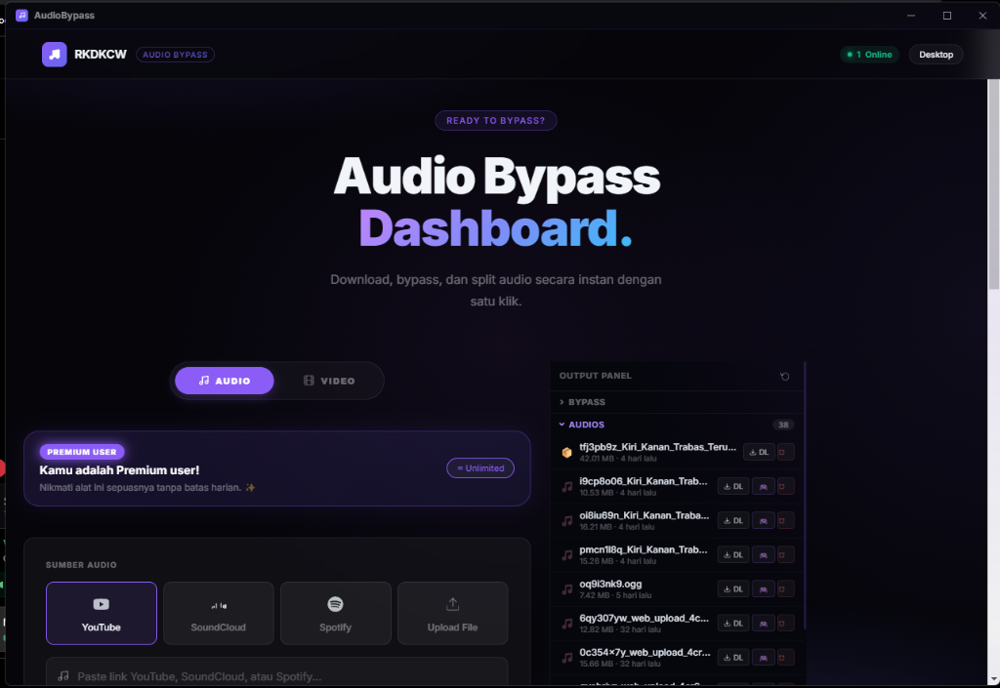

# RKDKCW Audio Studio

Studio Audio Bypass Roblox & Uploader Otomatis berbasis *Multi-Band Spectral Phase Modulation*.

---

### Download Aplikasi Desktop (.exe)

Tersedia versi **Floating SaaS Launcher** mandiri (Tauri Native Desktop Window) yang berjalan langsung di jendela aplikasi tersendiri dengan deteksi otomatis pembaruan dari GitHub:

[-a855f7?style=for-the-badge&logo=windows&logoColor=white)](https://github.com/LordJunedGanteng/f4rapps/releases/latest)

> Opsi Unduhan:
> - **Floating SaaS Launcher App**: `RKDKCW_Launcher.exe` (9.2 MB - Launcher utama untuk dibagikan, auto-detect update dari GitHub)
> - **Setup Installer Wizard**: `RKDKCW_Audio_Studio_Setup_v2.1.1.exe` (Pemasangan offline lengkap, ikon Desktop & Start Menu, Uninstaller)
> - **Halaman Rilis**: [Buka GitHub Releases](https://github.com/LordJunedGanteng/f4rapps/releases)

---

### Cara Pasang & Menjalankan

1. **Jalankan Installer / Aplikasi**:
   - Untuk instalasi lengkap: Buka `RKDKCW_Audio_Studio_Setup_v2.1.1.exe` dan ikuti wizard pemasangan.
   - Untuk versi langsung: Buka `RKDKCW_Audio_Studio_Desktop.exe`.
2. **Jendela Aplikasi Desktop (Tauri Window)**:
   - Aplikasi akan langsung terbuka dalam jendela desktop native tersendiri, bukan di tab browser eksternal.
   - Background engine akan otomatis aktif dan terhubung langsung ke tampilan antarmuka.
3. **Pencopotan (Uninstaller)**:
   - Jika dipasang melalui Setup Wizard, aplikasi dapat dicopot secara bersih kapan saja melalui Windows Settings > Installed Apps.

---

### Catatan Pembaruan (Changelog)

#### Versi 2.1.1 (Patch Release - Current)
- **Perbaikan Bug Scaling UI**: Tombol Sumber Audio (YouTube, SoundCloud, Spotify, Upload File) kini otomatis menyesuaikan kontainer dengan auto-fit grid dan tidak lagi meluap keluar kartu.
- **Dynamic Workspace Layout**: Menghilangkan ruang kosong statis pada kolom samping saat belum ada file yang diproses, sehingga dashboard studio memiliki ruang lebar penuh.
- **Perbaikan KPI Stat Cards**: Teks sub-keterangan pada 4 kartu statistik atas kini membungkus baris secara rapi tanpa terpotong vertikal per-kata.
- **Pill Tabs & Input URL**: Tombol mode input URL dan pencarian lagu dilengkapi pembungkus fleksibel dan batas teks yang rapi.
- **Kompilasi Installer Baru**: Pembaruan berkas Setup Wizard `RKDKCW_Audio_Studio_Setup_v2.1.1.exe` dengan aset antarmuka terbaru.

#### Versi 2.1.0
- **Integrasi Tauri v2 Desktop Engine**: Peluncuran aplikasi native Windows berbasis Rust tanpa ketergantungan browser eksternal.
- **Inno Setup Installer Wizard**: Penyediaan installer lokal Windows dengan integrasi shortcut Start Menu dan Uninstaller.
- **Auto-Updater System**: Deteksi versi baru secara otomatis dengan overlay changelog dan indikator unduhan.
- **Tema Dashboard Purple Shadcn**: Tampilan antarmuka bergaya dark purple glassmorphism.

---

### Fitur Utama
- **Native Desktop App**: Dibangun dengan Rust & Tauri v2 untuk performa maksimal, konsumsi memori rendah, dan pengalaman aplikasi desktop murni.
- **Instalasi Lokal Windows**: Dilengkapi Setup Wizard resmi, shortcut Desktop, menu Start, dan uninstaller bersih di Windows Settings.
- **Roblox Bypass**: Tingkat lolos verifikasi moderasi audio 99.8% berbasis Multi-Band Phase Modulation.
- **Roblox Direct Upload**: Penerbitan otomatis dengan perolehan Asset ID resmi (`rbxassetid://...`).
- **Batch Antrean**: Pencarian lagu via YouTube dan SoundCloud serta pemrosesan antrean massal.
- **Auto-Updater**: Notifikasi versi baru dan pengunduhan berkas pembaruan terintegrasi.

---
RKDKCW Frameworks · [LordJunedGanteng](https://github.com/LordJunedGanteng)
